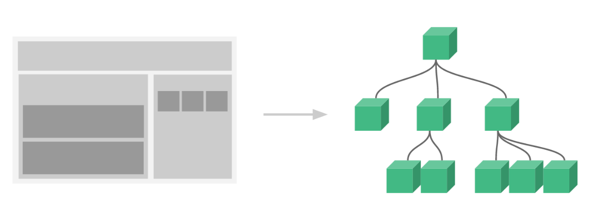
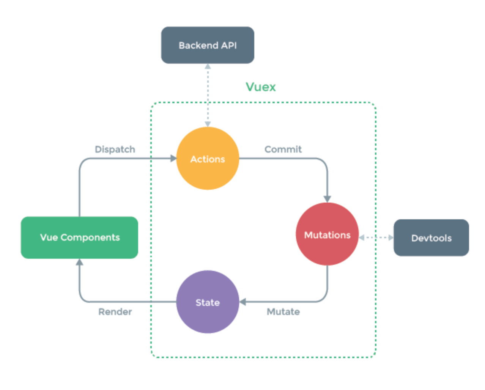

# vue 组件通信

## 什么是组件？

> 组件是可复用的 Vue 实例，且带有一个名字。

组件可以看成自定义的 HTML 元素，其实是对是对可重用代码 (html/css/js) 的封装。

## 注册组件

Vue 的组件注册，分为全局注册和局部注册。全局注册的组件可以用在任何新创建的 Vue 实例的模板中。而局部注册的组件，只能在当前实例总使用。

### 全局注册

假如我们需要注册一个全局的 `my-component` 组件，可以这么来全局注册它：

```js
Vue.component('my-component', {
  template: '<div>A custom component!</div>',
  ...
});

// 或者
import MyComponent from 'path/my-component.vue';
Vue.component('my-component', MyComponent);
```

### 局部注册

有的时候，我们的不需要把每个组件组件都注册到全局，也有可能你的组件只在当前实例中使用了一次，那么这个时候，我们可以在当前实例中的 `components` 选项里，局部注册这个组件：

```js
var someComponent = {
  template: '<div>some component!</div>',
  ...
};

new Vue({
  components: {
    someComponent: someComponent
  }
});


// 或者在模块系统中
import someComponet from 'path/some-component.vue';

export default {
  components: {
    someComponent: someComponent,
  }
}
```

### 组件注册注意项

全局注册的行为必须在根 Vue 实例创建之前发生。

组件的 `data` 选项必须是一个函数，这样么个实例就可以维护一份被返回对象的独立拷贝。

## 通过插槽分发内容

有时候，我们定义完组件，希望这些组件能够像原生 HTML 标签一样互相嵌套着使用，这在 Vue 中很容易实现，只需要在定义组件的时候 写一对 `<slot></slot>` 标签就可以了：

```html
<!-- header-top 组件 -->
<template>
  <div class="header-top">
    <slot></slot>
  </div>
</template>
```

```html
<template>
  <div>
    <header-top>awefawefwef</header-top>
  </div>
</template>
```

## 简单的 demo




、父子通信（静态数据，动态数据）
2、子父通信（子调父方法，父调子方法）
3、组件间的通信（eventBus，vuex）
4、其他（通过路由，storage）

## 组件通信

对于前端而言，并非是只有写界面才是最大的问题，很多的情况下，我们需要关注的是数据。

### 父子通信

父子组件：在父组件中传递数据给子组件，在子组件中接受数据。

首先，在 `父组件` 中调用 `子组件`，并传入值：

```html
<template>
  <div>
    <child :name="name"></child>
  </div>
</template>

<script>
import Child from './child.vue';

export default {
  components: {
    Child,
  },
  data() {
    return {
      name: '小明',
    };
  },
}
</script>
```

然后，在 `子组件` 中，通过 `props` 属性接收数据：

```html
<template>
  <div class="simple-page">
    {{ name }}
  </div>
</template>

<script>

export default {
  props: {
    name: {
      type: String,
      default: '',
    },
  }
}
</script>
```

注意：在父组件传值的之后，只要不是静态的字符串，都要加冒号 `:`

```html
<template>
  <child
    name="小明"
    :fullName="fullName"
    :age="age"
    :weight="120"
    :isAdults="true"
    :family="family"
  >
    fe
  </child>
</template>
<script>
{
  data() {
    return {
      fullName: '张小明',
      age: 18,
      name: '小明',
      family: ['father', 'mother', 'me'],
    };
  },
}
</script>
```

### 子父通信

子父通信：子组件将数据传递给父组件。

思路：在父组件中，给子组件传递一个方法；然后在子组件中，触发这个方法。这个方法，可以接受参数，因而实现了子组件与父组件的通信。

父组件：

```html
<template>
  <div class="parent">
    我是父组件
    <child @showMyage="tellMeAge"></child>
  </div>
</template>

<script>
import Child from './child.vue';

export default {
  components: {
    Child,
  },
  methods: {
    tellMeAge(data) {
      alert(`我知道了，你${data}岁了`);
    },
  },
}
</script>
```

子组件：

```html
<template>
  <div class="child">
    我是子组件
    <button @click="handleShowMyAge">我是小明，我要告诉你我几岁了</button>
  </div>
</template>

<script>
export default {
  methods: {
    handleShowMyAge() {
      this.$emit('showMyage', 18);
    },
  }
}
</script>
```

### 组件之间的通信

父子通信和子父通信，虽然能满足大部分业务组件之间的通信，数据的传递，但是，有一个限制，就是，他们的结构必须存在嵌套关系；而且，当父孙通信时，需要将数据或者绑定自定义的事件一层一层的传递下去，比较繁琐。而且如果，组件与组件之间并没有嵌套关系的时候，是不能相互通信的。这个时候，可以用 eventBus 方法。

思路：在需要通信的组件中，都引入一个新的 Vue 实例，后通过分别调用这个实例的事件触发和监听来实现通信和参数传递。

首先，定义一个 Vue 实例，并导出。

```js
import Vue from 'vue';

export default new Vue();
```

然后，在组件中，引入这个实例，触发事件。

```html
<template>
  <div class="player" @click="handlePunchOut">
    大家好，我是PlayerA：我出的是 {{ myRPS.label }}
  </div>
</template>

<script>
import eventBus from '../../utils/eventBus';
import { getRPS } from '../../utils/common';

export default {
  data() {
    return {
      myRPS: {},
    };
  },
  mounted() {
    this.handlePunchOut();
  },
  methods: {
    handlePunchOut() {
      const currentRPS = getRPS();
      this.myRPS = currentRPS;
      eventBus.$emit('RPS_a', currentRPS);
    },
  },
};
</script>
```

最后，在另一个组件中监听这个事件。

```html
<template>
  <div class="referee">
    大家好，我是裁判。<br>
    <span>{{ RPS_a ? `A出的是：${RPS_a.label}` : 'A还没出'}}</span><br>
    <span>{{ RPS_b ? `B出的是：${RPS_b.label}` : 'B还没出'}}</span><br>
    <span v-if="result">结果是：{{ result }}</span>
  </div>
</template>

<script>
import eventBus from '../../utils/eventBus';

export default {
  data() {
    return {
      RPS_a: null,
      RPS_b: null,
    };
  },
  computed: {
    result() {
      const playerA = this.RPS_a;
      const playerB = this.RPS_b;
      let result = '';
      if (!playerA || !playerB) {
        return result;
      }
      const diff = playerA.value - playerB.value;
      if (diff === 0) {
        result = '平局';
      } else if (diff === -1 || diff === 2) {
        result = 'PlayerA 赢了';
      } else {
        result = 'PlayerB 赢了';
      }
      return result;
    },
  },
  created() {
    const that = this;
    eventBus.$on('RPS_a', (data) => {
      that.RPS_a = data;
    });
    eventBus.$on('RPS_b', (data) => {
      that.RPS_b = data;
    });
  },
};
</script>
```

eventBus 方法，存在的问题：首先是事件的触发时间点，和监听的时间点需要注意。有可能你触发 emit 事件，但是，你监听的代码还没执行，可能产生错误。需要从 html 结构，和 Vue 生命周期去排查。

事件名不能重复。

### Vuex

小型项目，通过 eventBus 来传递数据，是比较方便的，但是如果是大型的项目，就显得不灵活了，这个时候应该用 Vuex 来做数据交互。

Vuex 记住一个流程就可以了。

组件触发 (dispatch)一个 `action`，然后 `action` 提交 (commit) 一个 `mutation`，然后 `mutation` 改变 `state` 中的数据，最后，反映是视图中。



`action` 可以包含任意异步操作，因此，可以在 `action` 中，封装后端的请求。

`mutation` 是修改 state 态的唯一方法，因此可以在这里监听数据的流动，devTool。

首先，在根实例中引入Vuex:

```js
import Vue from 'vue';
import App from './App.vue';
import store from './store/';
import router from './router';

Vue.config.productionTip = false;

new Vue({
  router,
  store,
  render: h => h(App),
}).$mount('#app');
```

然后定义 store 中的属性与方法：

```js
import Vue from 'vue';
import Vuex from 'vuex';

Vue.use(Vuex);

export default new Vuex.Store({
  state: {
    playerA: null,
    playerB: null,
  },
  getters: {
    getResultByPlayer: state => player => (state[player] ? state[player] : {}),
  },
  actions: {
    savePlayerA(context, payload) {
      context.commit('savePlayerAResult', payload);
    },
    savePlayerB(context, payload) {
      context.commit('savePlayerBResult', payload);
    },
  },
  mutations: {
    savePlayerAResult(state, payload) {
      state.playerA = payload;
    },
    savePlayerBResult(state, payload) {
      state.playerB = payload;
    },
  },
});
```

最后，在组件中接收 store 中的属性，或者触发 store 中的方法：

```html
<template>
  <div class="referee">
    大家好，我是裁判。<br>
    <span>{{ RPS_a ? `A出的是：${RPS_a.label}` : 'A还没出'}}</span><br>
    <span>{{ RPS_b ? `B出的是：${RPS_b.label}` : 'B还没出'}}</span><br>
    <span v-if="result">结果是：{{ result }}</span>
  </div>
</template>

<script>
export default {
  computed: {
    RPS_a() {
      return this.$store.getters.getResultByPlayer('playerA');
    },
    RPS_b() {
      return this.$store.getters.getResultByPlayer('playerB');
    },
    result() {
      const playerA = this.RPS_a;
      const playerB = this.RPS_b;
      let result = '';
      if (!playerA || !playerB) {
        return result;
      }
      const diff = playerA.value - playerB.value;
      if (diff === 0) {
        result = '平局';
      } else if (diff === -1 || diff === 2) {
        result = 'PlayerA 赢了';
      } else {
        result = 'PlayerB 赢了';
      }
      return result;
    },
  },
};
</script>
```

### 路由传参

vue路由传参一共有三种方式。

第一种：通过 query 传参：

```html
<router-link :to="{path: '/router-query', query: { someQury: '123' }}">fefefeefefe</router-link>
```

```js
// 变成 /router-query?someQury=123
router.push({ path: '/router-query', query: { someQury: '123' }})
```

第二种：通过 param 传参，可刷新，Url上可见。

```js
{
  path: '/router-params/:id',
  name: 'routerParas',
  component: () => import('./views/router-params/index.vue'),
}
```

```html
<router-link :to="{ path: '/router-params/123' }">fefefeefefe</router-link>
```

```js
router.push({ path: '/router-params/123' })
router.push({name: 'routerParas', params: { id: '123' }});
```

第三种：通过 param 传参，不可刷新，Url上不可见。

```js
{
  path: '/router-params-hidden',
  name: 'routerParamsHidden',
  component: () => import('./views/router-params-hidden/index.vue'),
}
```

```html
<router-link :to="{name: 'routerParamsHidden', params: { userId: '123' }}">aowjeofajw</router-link>
```

```js
router.push({name: 'routerParamsHidden', params: { userId: '123' }});
```

注意：如果提供了 path，params 会被忽略，query 并不属于这种情况。

## Project setup

```sh
yarn install
```

### Compiles and hot-reloads for development

```sh
yarn run serve
```

### Compiles and minifies for production

```sh
yarn run build
```

### Lints and fixes files

```sh
yarn run lint
```
